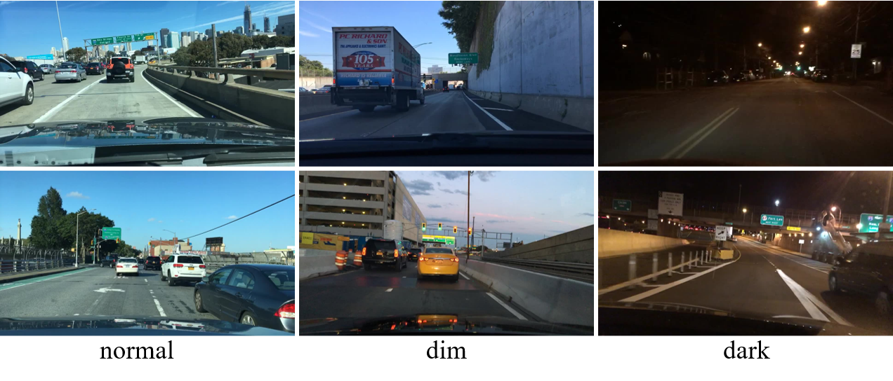
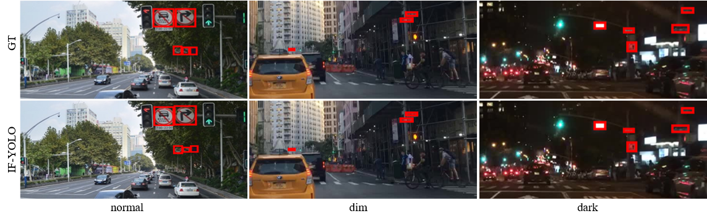

# IF-YOLO
**Illumination-Invariant Traffic Sign Detection for Autonomous Driving Under Adverse Lighting Conditions**

## Contents

### 💡 Illumination-Level Classification
  
Illustrates how dataset images are categorized by illumination levels (e.g., bright, dim, dark), which is critical for evaluating robustness under different lighting conditions.

### 📊 DITS Dataset Statistics
  
Provides an overview of the DITS dataset, including the number of targets of different sizes and the illumination-level distribution.

### 🎯 Detection Results Visualization
  
Shows detection results from IF-YOLO, demonstrating its capability to handle challenging low-light traffic sign scenarios.

### 🎥 Detection Process Demo Video

## 🔗 Project Page & Code
The code will be released soon
